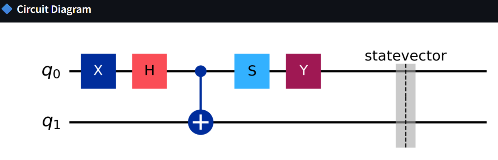

# Quantum Circuit Visualizer

An interactive web application for learning and visualizing quantum computing concepts through hands on experimentation with [quantum circuits](https://www.cl.cam.ac.uk/teaching/1920/QuantComp/Quantum_Computing_Lecture_5.pdf). This project provides an intuitive interface for building quantum circuits, simulating their behavior, and exploring the fascinating properties of quantum states through rich visualizations.


---

## Overview

Understanding quantum computing can be challenging due to its abstract mathematical nature and counterintuitive behavior. This Quantum Circuit Visualizer bridges that gap by offering a visual, interactive platform where users can construct quantum circuits using common quantum gates and immediately observe the results. Whether youre a student learning quantum mechanics, a researcher prototyping algorithms, or simply curious about quantum computing, this tool makes quantum states tangible and accessible.

The application supports circuits with one, two, or three qubits, allowing users to explore fundamental quantum phenomena such as [superposition](https://en.wikipedia.org/wiki/Quantum_superposition), [entanglement](https://en.wikipedia.org/wiki/Quantum_entanglement), and [quantum interference](https://en.wikipedia.org/wiki/Quantum_mechanics). Through interactive Bloch sphere representations and detailed [amplitude](https://en.wikipedia.org/wiki/Probability_amplitude) visualizations, users gain intuitive insights into how quantum gates manipulate quantum information. The platform handles all the complex mathematics behind the scenes while presenting results in an understandable, visually engaging format.

---

## Understanding Quantum Computing

### What is Quantum Computing?

Classical computers store information as bits that are either 0 or 1. Quantum computers use quantum bits, or **qubits**, which cqn exist in a **superposition** of both states simultaneously. This is fundamental difference allows quantum computers to process certain types of information exponentially faster than classical computers.

### Key Quantum Concepts

**Superposition** is the ability of a quantum system to exist in multiple states at once. When a qubit is in superposition, it has a probability of being measured as 0 and a probability of being measured as 1. The famous [Hadamard gate](https://en.wikipedia.org/wiki/Quantum_logic_gate) creates an equal superposition, where the qubit has a 50% chance of being measured as either 0 or 1.

**Entanglement** is a uniquely quantum phenomenon where two or more qubits become correlated in such a way that the state of one qubit cannot be described independently of the others. When qubits are entangled, measuring one qubit instantaneously affects the state of the other, regardless of the distance between them. This "[spooky action at a distance,](https://theconversation.com/spooky-action-at-a-distance-a-beginners-guide-to-quantum-entanglement-and-why-it-matters-in-the-real-world-266227)" as [Einstein](https://id.wikipedia.org/wiki/Albert_Einstein) called it, is a cornerstone of quantum computing and enables [Quantum Algorithms](https://en.wikipedia.org/wiki/Quantum_algorithm) to solve certain problems more efficiently than classical algorithms.

**Quantum Interference** allows Quantum Algorithms to amplify correct answers and cancel out wrong answers. By carefully manipulating the [phases of quantum](https://arxiv.org/pdf/2209.14278) states, we can increase the probability of measuring the desired outcome. This is the principle behind many Quantum Algorithms, including [Grover’s Search Algorithm](https://arxiv.org/abs/quant-ph/9605043) and [Shor’s Factoring Algorithm](https://arxiv.org/abs/quant-ph/9508027).

### The Qubit State

Mathematically, a single qubit state can be written as:

```
|ψ⟩ = α|0⟩ + β|1⟩
```

where [α](https://en.wikipedia.org/wiki/Alpha) and [β](https://en.wikipedia.org/wiki/Beta) are complex numbers called probability [amplitudes](https://en.wikipedia.org/wiki/Probability_amplitude), and |α|² + |β|² = 1. The quantities |α|² and |β|² represent the probabilities of measuring the qubit in state |0⟩ or |1⟩, respectively. The [complex phases](https://arxiv.org/pdf/2404.00743) of α and β encode important information that affects how the qubit interacts with quantum gates.

### Measurement and Probability

Unlike classical bits, which can be read without changing their state, measuring a qubit collapses its superposition. Before measurement, a qubit exists in all possible states simultaneously. Upon measurement, the qubit "chooses" one of the basis states (|0⟩ or |1⟩) with probabilities determined by its amplitudes. After measurement, the qubit is no longer in superposition but exists definitively in the measured state.

This probabilistic nature is fundamental to quantum mechanics and is not due to ignorance or [hidden variables](https://en.wikipedia.org/wiki/Hidden-variable_theory). It represents the true nature of quantum reality. Our application simulates this behavior by running multiple measurement "shots" and displaying the statistical distribution of outcomes.

---

## The Bloch Sphere Representation

### What is a Bloch Sphere?

The [Bloch Sphere](https://en.wikipedia.org/wiki/Bloch_sphere) is a geometric representation of a single qubits quantum state as a point on or inside a unit sphere in three dimensional space. It provides an intuitive way to visualize quantum states and understand how quantum gates transform them.


### Anatomy of the Bloch Sphere

```
                    |0⟩ (North Pole)
                     ↑
                     |
                     |
                     |
    |-⟩ ←------------●------------→ |+⟩
         (West)      |     (East)
                     |
                     |
                     ↓
                   |1⟩ (South Pole)

         |+i⟩ (out of page)
         |-i⟩ (into page)
```

**Z-axis (Vertical - Blue):** Represents the population difference between |0⟩ and |1⟩ states:
- North pole (+Z): Pure |0⟩ state
- South pole (-Z): Pure |1⟩ state
- Equator: Equal superposition of |0⟩ and |1⟩

**X-axis (Horizontal Left-Right - Red):** Represents the real component of superposition:
- +X direction: |+⟩ = (|0⟩ + |1⟩)/√2 state
- -X direction: |-⟩ = (|0⟩ - |1⟩)/√2 state

**Y-axis (Horizontal Front-Back - Green):** Represents the imaginary component (phase):
- +Y direction: |+i⟩ = (|0⟩ + i|1⟩)/√2 state
- -Y direction: |-i⟩ = (|0⟩ - i|1⟩)/√2 state

### Interpreting Bloch Vectors

The **Bloch vector** is an arrow from the center of the sphere to a point on its surface, representing the qubits current state. The vectors direction indicates which superposition of |0⟩ and |1⟩ the qubit is in, while its length indicates purity:

- **Length = 1 (touching surface):** Pure quantum state. The qubit is in a well defined superposition.
- **Length < 1 (inside sphere):** Mixed state. This typically indicates entanglement with other qubits or decoherence.

### Why the Bloch Sphere Matters

The [Bloch Sphere](https://en.wikipedia.org/wiki/Bloch_sphere) transforms abstract quantum states into visual, geometric objects. Instead of wrestling with complex numbers and probability [amplitudes](https://en.wikipedia.org/wiki/Probability_amplitude), you can see how quantum gates rotate and reflect the state vector. This geometric intuition is invaluable for understanding [Quantum Algorithms](https://en.wikipedia.org/wiki/Quantum_algorithm) and designing quantum circuits.

Our application uses **3D Bloch spheres** that you can rotate with your mouse, allowing you to explore quantum states from any angle and build spatial intuition about quantum mechanics.

- [Qiskit Textbook: The Bloch Sphere](https://qiskit.org/textbook/ch-states/representing-qubit-states.html) – an excellent introduction with math and interactive code.
- [Wikipedia: Bloch Sphere](https://en.wikipedia.org/wiki/Bloch_sphere) – general overview with formulas and history.
- [YouTube: Bloch Sphere Visualization](https://www.youtube.com/watch?v=F_Riqjdh2oM) – short video explaining the Bloch sphere intuitively.
- [Paper: The Bloch Sphere in Quantum Mechanics](https://arxiv.org/abs/quant-ph/0406188) – more formal and mathematical treatment.
---

## Quantum Gates

Quantum gates are the building blocks of quantum circuits, analogous to logic gates in classical computing. However, quantum gates are fundamentally different: they must be **reversible** (no information is lost) and they operate on quantum superpositions.

### Single-Qubit Gates

| Gate | Symbol | Matrix | Effect | Bloch Sphere Action |
|------|--------|--------|--------|---------------------|
| **Pauli-X** | X | [[0,1],[1,0]] | Bit flip: \|0⟩ ↔ \|1⟩ | 180° rotation around X-axis |
| **Pauli-Y** | Y | [[0,-i],[i,0]] | Bit and phase flip | 180° rotation around Y-axis |
| **Pauli-Z** | Z | [[1,0],[0,-1]] | Phase flip: \|1⟩ → -\|1⟩ | 180° rotation around Z-axis |
| **Hadamard** | H | (1/√2)[[1,1],[1,-1]] | Creates superposition | 90° rotation + reflection |
| **S Gate** | S | [[1,0],[0,i]] | Phase gate (√Z) | 90° rotation around Z-axis |
| **T Gate** | T | [[1,0],[0,e^(iπ/4)]] | π/8 gate | 45° rotation around Z-axis |

#### Detailed Gate Descriptions

[**Pauli-X Gate (NOT Gate):**](https://en.wikipedia.org/wiki/Quantum_logic_gate) The quantum equivalent of a classical NOT gate. It flips |0⟩ to |1⟩ and vice versa. On the Bloch sphere, it rotates the state vector 180° around the X-axis. This gate is fundamental for state preparation and is used extensively in [Quantum Algorithms](https://en.wikipedia.org/wiki/Quantum_algorithm).

[**Hadamard Gate (H):**](https://en.wikipedia.org/wiki/Quantum_logic_gate) Perhaps the most important quantum gate, the Hadamard creates equal superposition. Starting from |0⟩, it produces the state (|0⟩ + |1⟩)/√2, which has a 50% probability of measuring 0 or 1. This gate is the key to quantum parallelism and is used at the beginning of most Quantum Algorithms to explore multiple computational paths simultaneously.

[**Pauli-Z Gate:**](https://en.wikipedia.org/wiki/Quantum_logic_gate) Leaves |0⟩ unchanged but adds a negative phase to |1⟩. While it doesn't affect measurement probabilities (since |-1|² = 1), the phase is crucial for quantum interference. On the Bloch sphere, it rotates the state 180° around the Z-axis.

[**S and T Gates:**](https://en.wikipedia.org/wiki/Quantum_logic_gate#Clifford_gates) These are phase gates that introduce more subtle phase shifts. The S gate rotates 90° around Z, while the T gate rotates 45°. These gates are essential for fine tuning Quantum Algorithms and are part of the universal gate set that can approximate any quantum operation.

### Multi-Qubit Gates

| Gate | Description | Qubits | Effect | Use Case |
|------|-------------|--------|--------|----------|
| **CNOT** | Controlled-NOT | 2 | Flips target if control is \|1⟩ | Creating entanglement |
| **SWAP** | Swap qubits | 2 | Exchanges states of two qubits | Quantum communication |
| **Toffoli** | Controlled-Controlled-NOT | 3 | Flips target if both controls are \|1⟩ | Quantum error correction |

#### Detailed Multi-Qubit Gate Descriptions
[**CNOT Gate (Controlled-NOT):**](https://en.wikipedia.org/wiki/Quantum_logic_gate)  
The Controlled-NOT (CNOT) gate is one of the most fundamental two-qubit gates in quantum computing and serves as the building block for many [Quantum Algorithms](https://en.wikipedia.org/wiki/Quantum_algorithm).  
It operates on two qubits: a ***control qubit*** and a ***target qubit***. The rule is simple:  
- If the control qubit is in the state `|0⟩`, the target qubit remains unchanged.  
- If the control qubit is in the state `|1⟩`, the target qubit is flipped (from `|0⟩` to `|1⟩`, or from `|1⟩` to `|0⟩`).  
This behavior can be summarized as:  
- |00⟩ → |00⟩  
- |01⟩ → |01⟩  
- |10⟩ → |11⟩  
- |11⟩ → |10⟩  
Because of its ability to ***correlate two qubits***, the [CNOT](https://en.wikipedia.org/wiki/Quantum_logic_gate) is crucial for creating ***entanglement***. For example, if a Hadamard gate is first applied to the control qubit, placing it into a superposition `( |0⟩ + |1⟩ ) / √2`, and then a CNOT is applied with that qubit as control and another initialized in `|0⟩` as target, the resulting state becomes:  
( |00⟩ + |11⟩ ) / √2  
This is known as a [***Bell state***](https://en.wikipedia.org/wiki/Bell_state), one of the maximally entangled states in quantum mechanics.  
The CNOT gate is therefore not only a workhorse of quantum logic but also a fundamental resource for building more complex quantum circuits, enabling quantum teleportation, superdense coding, and error correction codes. Virtually every non-trivial quantum algorithm makes use of the CNOT in some form.


[**SWAP Gate:**](https://en.wikipedia.org/wiki/Quantum_logic_gate)  
The SWAP gate is a two qubit quantum gate that exchanges the quantum states of its two input qubits.  
If the first qubit is in state |[ψ](https://en.wikipedia.org/wiki/Psi_(Greek))⟩ and the second is in state |[φ](https://en.wikipedia.org/wiki/Phi)⟩, then after applying a [SWAP Gate](https://en.wikipedia.org/wiki/Quantum_logic_gate) their states are exchanged `|ψ⟩|φ⟩ → |φ⟩|ψ⟩`. This operation may sound conceptually simple, but it plays a critical role in practical quantum computing. In many quantum hardware architectures, qubits cannot all interact directly with each other due to ***limited connectivity***. The SWAP Gate provides a way to ***[route information](https://arxiv.org/pdf/2004.08133)*** across the device by moving quantum states into positions where the required interactions or entanglements can be performed.  
For example, if qubit A needs to interact with qubit C but only has a direct connection to qubit B, a sequence of SWAP Gates can be used to move the state of A through B until it reaches C. In this way, SWAP acts as a "data mover" within a quantum processor.  
Although the SWAP Gate itself does not create entanglement, it is still considered a ***universal building block*** in circuit design. It can also be decomposed into a sequence of three CNOT gates, which makes it possible to implement on any architecture that supports [CNOT](https://en.wikipedia.org/wiki/Quantum_logic_gate) as a native two qubit gate.  
Thus, the SWAP gate is essential for ***circuit optimization, qubit routing, and hardware aware quantum algorithm design***, ensuring that logical qubits can be efficiently mapped to the physical qubits available on real quantum hardware.


[**Toffoli Gate (CCNOT):**](https://en.wikipedia.org/wiki/Quantum_logic_gate)  
The Toffoli gate, also known as the ***Controlled-Controlled-NOT (CCNOT)*** gate, is a three qubit gate that extends the idea of the [CNOT Gate](https://en.wikipedia.org/wiki/Quantum_logic_gate).  
It has ***two control qubits*** and ***one target qubit***. The target qubit is flipped (|0⟩ → |1⟩ or |1⟩ → |0⟩) ***only when both control qubits are in the state |1⟩***. In all other cases, the target qubit remains unchanged.  
This behavior can be summarized as:  
- |000⟩ → |000⟩  
- |010⟩ → |010⟩  
- |100⟩ → |100⟩  
- |110⟩ → |111⟩  
- |111⟩ → |110⟩  
(and similarly, the first two qubits are always preserved, while the last one flips only if both are |1⟩).  
The Toffoli gate is especially important because:  
1. ***For classical reversible computing***  
   Any classical logic circuit can be constructed using [Toffoli Gate](https://en.wikipedia.org/wiki/Quantum_logic_gate), since it can reproduce AND, OR, and NOT operations in a reversible manner.  
2. ***For quantum error correction***  
   Many quantum error correcting codes rely on Toffoli to implement syndrome measurements and correction steps without destroying quantum information.  
3. ***Bridge between classical and quantum logic***  
   The Toffoli gate allows embedding of classical logic within quantum circuits, making it useful for algorithms that combine classical control structures with quantum operations.  
Although powerful, the Toffoli Gate. On real hardware, it is typically decomposed into a sequence of single qubit and two qubit gates, since most quantum processors do not support Toffoli as a native operation.  
Overall, the Toffoli gate is a cornerstone in the design of [Quantum Algorithms](https://en.wikipedia.org/wiki/Quantum_algorithm), especially in tasks that require ***error correction, reversible logic, or controlled multi qubit interactions***.


### Gate Combinations and Quantum Algorithms

Individual gates are powerful, but Quantum Algorithms arise from carefully orchestrated sequences of gates. For example:

- [**Bell State Creation:**](https://en.wikipedia.org/wiki/Bell_state) H on qubit 0, then CNOT(0→1) creates maximum entanglement
- [**Quantum Teleportation:**](https://en.wikipedia.org/wiki/Quantum_teleportation) Uses entanglement and specific gate sequences to transfer quantum information
- [**Grovers Algorithm**](https://arxiv.org/abs/quant-ph/9605043) Combines Hadamard gates, phase flips, and diffusion operators to search unsorted databases

Our application allows you to experiment with these combinations and observe their effects in real time.

---

## Features

### 1. Circuit Construction


Build quantum circuits by selecting from a comprehensive library of quantum gates. The interface dynamically adapts to show only applicable gates for your chosen number of qubits, preventing invalid configurations. Add gates sequentially, visualize your circuit as you build, and modify or clear your circuit at any time.

**Available Configurations:**
- **1 Qubit:** H, X, Y, Z, S, T gates
- **2 Qubits:** All single-qubit gates + CNOT, SWAP
- **3 Qubits:** All single-qubit gates + CNOT, SWAP, Toffoli

Each gate can be applied to specific qubits, and the system maintains a clear, ordered list of all operations.

### 2. 3D Bloch Sphere Visualization


Experience quantum states like never before with fully interactive Plotly powered Bloch spheres. Click and drag to rotate the visualization from any angle, zoom in to examine details, and explore how quantum gates transform state vectors in real time.

**For Single Qubits:**
- Full 3D Bloch sphere with labeled axes
- Color coded coordinate system (X=red, Y=green, Z=blue)
- Purple state vector showing current quantum state
- State labels for common basis states
- Real time vector component display (X, Y, Z values)

**For Two Qubits:**
- Side by side Bloch spheres for each qubit
- Reduced density matrices computed via partial trace
- Purity indicators showing entanglement
- Independent rotation of each sphere
- Clear labeling of which sphere corresponds to which qubit

### 3. State Analysis


View your quantum state from multiple perspectives:

**Statevector Display:**
- Complete list of complex [amplitudes](https://en.wikipedia.org/wiki/Probability_amplitude) for each basis state
- Formatted [complex](https://en.wikipedia.org/wiki/Complex_number) numbers ([real](https://en.wikipedia.org/wiki/Real_number) + [imaginary ](https://en.wikipedia.org/wiki/Imaginary_number)components)
- Probability values |amplitude|² for each state
- [Big-endian](https://en.wikipedia.org/wiki/Endianness) notation (q0 is leftmost bit)

**Probability Distribution:**
- Sortable table showing all non zero probability states
- Percentage display for intuitive understanding
- Visual highlighting of dominant states

**Measurement Histogram:**
- Interactive bar chart of measurement outcomes
- Based on user configurable number of shots (100-10000)
- Demonstrates quantum measurements probabilistic nature
- Color coded for visual clarity

**Circuit Statistics:**
- Total number of qubits
- Circuit depth (longest path through gates)
- Gate count (total operations)
- Breakdown by gate type

### 4. Visualization for 3 Qubits


For three qubit systems, the application provides a custom 3D state city visualization that displays amplitude components as bars:

- **Red bars:** Real[amplitude](https://en.wikipedia.org/wiki/Probability_amplitude) components (positive and negative)
- **Blue bars:** Imaginary amplitude components (positive and negative)
- **X-axis:** All 8 basis states in [Big-endian](https://en.wikipedia.org/wiki/Endianness) order (000, 001, 010, ..., 111)
- **Bar height:** [Magnitude](https://en.wikipedia.org/wiki/Magnitude_(mathematics)) of each component
- **Proper ordering:** Always uses big endian convention for consistency

This visualization reveals the complete quantum state structure, showing which basis states contribute to the superposition and the phase relationships between them.

### 5. Big-endian Convention Throughout

Unlike many quantum computing platforms that use [Little-endian](https://en.wikipedia.org/wiki/Endianness) notation (rightmost bit is q0), this application consistently uses [Big-endian](https://en.wikipedia.org/wiki/Endianness) notation (leftmost bit is q0) across all outputs. This matches intuitive left-to-right reading and eliminates a common source of confusion.

**Example:** For state |q0 q1 q2⟩:
- **Big-endian** |011⟩ means: q0=0, q1=1, q2=1
- This is what you see in all visualizations, tables, and histograms

### 6. Real Time Quantum Simulation

Every change to your circuit triggers immediate simulation using Qiskit performance Aer simulator. Adjust measurement shots to observe how statistical sampling affects outcomes, and watch probabilities converge to their theoretical values as shot count increases.

---

## Technology Stack

This project leverages cutting edge python libraries to deliver a seamless quantum computing experience:

### Core Technologies

**Qiskit (≥1.0.0)**
The heart of our quantum engine. Qiskit, developed by [IBM Research](https://research.ibm.com/), provides industrial strength quantum computing capabilities including circuit construction, gate operations, and state simulation. We use the modern Qiskit API with `backend.run()` (not the deprecated `execute()`) to ensure future compatibility. The Aer simulator backend enables accurate quantum state evolution on classical hardware. [See Qiskit documentation](https://qiskit.org/documentation/) or [Qiskit API Reference](https://docs.quantum.ibm.com/api/qiskit)

**Streamlit (≥1.28.0)**
Powers the entire web interface with its reactive programming model. Streamlit declarative approach makes building interactive applications intuitive while maintaining professional aesthetics. Its session state management handles the dynamic circuit building process, and automatic rerun capabilities ensure the UI always reflects the current quantum state. [See Streamlit documentation](https://docs.streamlit.io/)

**Plotly (≥5.17.0)**
Delivers stunning interactive 3D visualizations. Plotly's WebGL-based rendering provides hardware accelerated graphics that remain smooth even with complex scenes. The library declarative API makes creating sophisticated visualizations straightforward, and its built-in interactivity (zoom, rotate, pan) requires no additional code. [See Plotly Python documentation](https://plotly.com/python/) or [Plotly Python API Reference](https://plotly.com/python-api-reference/)

**NumPy (≥1.24.0)**
Handles all mathematical heavy lifting. NumPy optimized array operations enable efficient complex number arithmetic, matrix multiplications for density matrices, and partial trace computations for reduced states. Its integration with Qiskit ensures seamless data flow between quantum circuits and numerical analysis. [See NumPy documentation](https://numpy.org/doc/) or [NumPy API Reference](https://numpy.org/doc/stable/reference/)

**Matplotlib (≥3.7.0)**
Generates static visualizations including circuit diagrams and 3D state city plots. While Plotly handles interactive graphics, Matplotlib excels at publication-quality static figures and integrates seamlessly with Streamlit rendering pipeline. [See Matplotlib documentation](https://matplotlib.org/stable/contents.html)

### Architecture Diagram

```
┌─────────────────────────────────────────────────────────────┐
│                    Streamlit Web Interface                  │
│  (User Input, Circuit Builder, Visualization Display)       │
└────────────────────────────────┬────────────────────────────┘
                                 │
                  ┌──────────────┴─────────────┐
                  │                            │
          ┌───────▼────────┐          ┌────────▼────────┐
          │   gates.py     │          │    utils.py     │
          │                │          │                 │
          │ • Gate funcs   │          │ • Simulation    │
          │ • Circuit      │          │ • Bloch vector  │
          │   builder      │          │ • Density matrix│
          │ • Gate catalog │          │ • Visualization │
          └───────┬────────┘          └────────┬────────┘
                  │                            │
                  └──────────────┬─────────────┘
                                 │
                    ┌────────────▼───────────────┐
                    │      Qiskit + Aer          │
                    │  (Quantum Simulation)      │
                    └────────────┬───────────────┘
                                 │
                    ┌────────────▼───────────────┐
                    │   NumPy / Plotly / MPL     │
                    │  (Math & Visualization)    │
                    └────────────────────────────┘
```

---

## Installation

### Prerequisites

- Python 3.8 or higher
- pip (Python package manager)
- 4GB RAM minimum (8GB recommended for 3-qubit circuits)
- Web browser (Chrome, Firefox, Safari, or Edge)

### Step-by-Step Installation

1. **Clone or download this repository:**

```bash
git clone https://github.com/IVerse-VDV/quantum-computing-simulation.git
```
```bash
cd quantum-visualizer
```

2. **Create a virtual environment (recommended):**

```bash
# On Windows
python -m venv venv
venv\Scripts\activate

# On macOS/Linux
python3 -m venv venv
source venv/bin/activate
```

3. **Install dependencies:**

```bash
pip install -r requirements.txt
```

This installs all required packages:
- qiskit (≥1.0.0)
- qiskit-aer (≥0.13.0)
- streamlit (≥1.28.0)
- plotly (≥5.17.0)
- matplotlib (≥3.7.0)
- numpy (≥1.24.0)
- pylatexenc

4. **Verify installation:**

```bash
python -c "import qiskit; print(f'Qiskit version: {qiskit.__version__}')"
```

If this prints a version number, you're ready to go!

### Troubleshooting Installation

**Issue:** Qiskit installation fails
- **Solution:** Ensure you have Python 3.8+. Try upgrading pip: `pip install --upgrade pip`

**Issue:** Streamlit doesn't open browser
- **Solution:** Manually open the URL shown in terminal (usually `http://localhost:8501`)

**Issue:** Plotly visualizations don't render
- **Solution:** Clear browser cache or try a different browser

---

## Usage Guide

### Starting the Application

From your project directory with activated virtual environment:

```bash
streamlit run app.py
```
or
```bash
python -m streamlit run app.py
```

Streamlit will launch a local web server and open your default browser to the application. If the browser doesnt open automatically, copy the URL from your terminal (typically `http://localhost:8501`).

### Building Your First Quantum Circuit

#### Step 1: Choose Number of Qubits

In the sidebar, select how many qubits you want to work with:
- **1 qubit:** Best for learning individual gate effects
- **2 qubits:** Explore entanglement and multi qubit gates
- **3 qubits:** Experiment with complex quantum states

#### Step 2: Add Quantum Gates

1. Select a gate from the dropdown menu
2. Read the gate description that appears
3. Choose which qubit(s) to apply it to:
   - Single-qubit gates: Select target qubit (q0, q1, or q2)
   - CNOT: Select control and target qubits
   - SWAP: Select two qubits to exchange
   - Toffoli: Select two control qubits and one target
4. Click "➕ Add Gate" to append it to your circuit

#### Step 3: Build Gate Sequences

Continue adding gates to create a circuit. The sidebar shows your current gate sequence. You can:
- Delete individual gates using the 🗑️ button next to each
- Clear the entire circuit with "🗑️ Clear All"
- Add gates in any order to experiment

#### Step 4: Adjust Simulation Parameters

Use the "Measurement Shots" slider to control how many times the quantum circuit is measured (100-10,000 shots). More shots give more accurate statistical results but take slightly longer to simulate.

#### Step 5: Explore the Results

The main panel displays multiple visualizations:

**Circuit Diagram:** A circuit diagram is a visual representation of a quantum program, where qubits are drawn as horizontal lines and quantum gates are placed along those lines to indicate the operations being applied. Each gate represents a transformation of the qubit’s state, and connections between gates (such as control and target lines in a [CNOT Gate](https://en.wikipedia.org/wiki/Quantum_logic_gate)) show how qubits interact with each other. By following the diagram from left to right, you can trace the logical flow of the computation. This graphical notation provides an intuitive way to understand and communicate how [Quantum Algorithms](https://en.wikipedia.org/wiki/Quantum_algorithm)  are structured, making it easier to see the sequence of operations, entanglement between qubits, and the overall design of the circuit.

**Bloch Sphere (1-2 qubits):** The Bloch sphere is a powerful way to visualize the state of a single qubit as a point on the surface of a 3D unit sphere. In this representation, the north pole corresponds to the basis state |0⟩ and the south pole corresponds to |1⟩. Any point in between represents a superposition of these two states, where the angle of rotation around the sphere encodes the phase and the latitude determines the probability amplitude of |0⟩ and |1⟩.
An interactive Bloch sphere allows you to click and drag to rotate the view, and scroll to zoom in or out. This helps in understanding how quantum gates transform qubits — for example, a Hadamard gate rotates the qubit from the north pole into a balanced superposition along the equator, while a Pauli-X gate flips the state from |0⟩ to |1⟩. For two-qubit systems, Bloch spheres can be used individually to represent each qubit’s reduced state, giving insight into entanglement and correlations.
This visualization is not just aesthetic, but also educational: by watching how quantum operations map onto rotations on the sphere, you can build an intuitive grasp of otherwise abstract quantum mechanics concepts.

**State City (3 qubits):** For systems larger than two qubits, the Bloch sphere can no longer fully capture the quantum state, since the state space grows exponentially. Instead, a State City plot is used. This is a 3D bar chart where each bar corresponds to one of the computational basis states (e.g., |000⟩, |001⟩, ..., |111⟩). The height of each bar represents the [magnitude](https://en.wikipedia.org/wiki/Magnitude_(mathematics)) of the complex amplitude associated with that basis state, while the color or orientation of the bar indicates the phase of the amplitude.
This visualization provides a clear picture of how probability [amplitudes](https://en.wikipedia.org/wiki/Probability_amplitude) are distributed across all possible states of the qubits. For example, a uniform superposition of three qubits would show eight bars of equal height, while entangled or algorithm-specific states may show only a few dominant bars with specific phase relationships.
By examining the State City plot, you can gain intuition about the structure of multi-qubit states, see the effects of quantum gates on higher-dimensional systems, and better understand how amplitudes interfere to produce measurement outcomes.

**Statevector:** The statevector is the complete mathematical description of a quantum system, containing all the amplitudes that define its quantum state.  
For an *n*-qubit system, the statevector has `2^n` complex numbers, each corresponding to one of the computational basis states.  
In general, the statevector can be written as:
|ψ⟩ = α₀|00...0⟩ + α₁|00...1⟩ + ... + α₂ⁿ⁻¹|11...1⟩  
Each coefficient αᵢ is a complex number, and the squared [magnitude](https://en.wikipedia.org/wiki/Magnitude_(mathematics)) |αᵢ|² gives the probability of measuring the system in that basis state. The statevector must always be normalized, meaning:  
[Σ](https://en.wikipedia.org/wiki/Sigma) |αᵢ|² = 1  
***Examples:***  
- Single qubit in superposition:  
  |ψ⟩ = (1/√2)|0⟩ + (1/√2)|1⟩  
- Two-qubit entangled Bell state:  
  |ψ⟩ = (1/√2)(|00⟩ + |11⟩)  
The statevector is essential in quantum simulations because it fully captures the behavior of the system before measurement collapses it into one definite outcome.

**Probability Distribution:** In quantum computing, the probability distribution describes the likelihood of each possible measurement outcome for a quantum state.  
When a quantum circuit is executed and measured, the statevector of the qubits collapses into one of the computational basis states (e.g., `|00⟩`, `|01⟩`, etc.).  
The probability of obtaining a specific outcome is determined by the squared [magnitude](https://en.wikipedia.org/wiki/Magnitude_(mathematics)) of its [amplitude](https://en.wikipedia.org/wiki/Probability_amplitude) in the statevector.  
For an *n*-qubit system, there are `2^n` possible outcomes. The probabilities of these outcomes form a distribution that always sums to 1:  
Σ P(outcomeᵢ) = 1  
***Example:***  
- If a single qubit is in superposition:  
  |ψ⟩ = (1/√2)|0⟩ + (1/√2)|1⟩  
  Then the probability distribution is:  
  - P(|0⟩) = 0.5  
  - P(|1⟩) = 0.5  
- For a 2-qubit Bell state:  
  |ψ⟩ = (1/√2)(|00⟩ + |11⟩)  
  The probability distribution is:  
  - P(|00⟩) = 0.5  
  - P(|11⟩) = 0.5  
  - P(|01⟩) = 0  
  - P(|10⟩) = 0  
Probability distributions are often displayed as **tables** or **histograms**, making it easier to see which measurement results are most likely after running a quantum algorithm.

**Measurement Histogram:** A measurement histogram is a bar chart that shows the frequency of each outcome obtained when running a quantum circuit multiple times (also called "shots").  
Unlike the probability distribution, which represents the *[theoretical](https://en.wikipedia.org/wiki/Theoretical_definition)* likelihood of each state, the measurement histogram displays the *experimental results* collected from actual runs or simulations.  
Each bar corresponds to one of the possible basis states (e.g., `|00⟩`, `|01⟩`, `|10⟩`, `|11⟩` for 2 qubits), and the height of the bar reflects how many times that state appeared during the measurements.  
The more shots you run, the closer the histogram typically gets to the theoretical probability distribution, although randomness and noise can still cause variations.  
This visualization is essential for analyzing the performance of quantum circuits and algorithms. It helps confirm whether the observed results match the expected theoretical predictions and also highlights the effects of noise, hardware imperfections, or statistical fluctuations in real quantum devices.

### Example Workflows

#### Creating a Bell State (Maximum Entanglement)

1. Select 2 qubits
2. Add Hadamard gate to q0
3. Add CNOT gate with control=q0, target=q1
4. Observe: Both Bloch spheres show mixed states (entanglement indicator!)
5. Histogram shows only |00⟩ and |11⟩ outcomes (50% each)

#### Exploring Superposition

1. Select 1 qubit
2. Add Hadamard gate to q0
3. Observe: Bloch vector points along +X axis (equal superposition)
4. Histogram shows 50% |0⟩ and 50% |1⟩

#### Testing Phase Effects

1. Select 1 qubit
2. Add Hadamard gate to q0
3. Add S gate to q0
4. Observe: Bloch vector rotates on the equator toward +Y
5. This shows phase change without affecting measurement probabilities!

#### Three-Qubit GHZ State

1. Select 3 qubits
2. Add Hadamard to q0
3. Add CNOT with control=q0, target=q1
4. Add CNOT with control=q1, target=q2
5. Observe: State city shows only |000⟩ and |111⟩ components
6. This is a maximally entangled three-qubit state!

---

## Project Structure

The codebase follows clean architecture principles with clear separation of concerns:

```
quantum-circuit-visualizer/
│
├── app.py                 # Main Streamlit application
├── gates.py               # Quantum gate definitions and circuit building
├── utils.py               # Simulation, analysis, and visualization utilities
├── requirements.txt       # Python package dependencies
├── README.md             # This file
```

### File Descriptions

**app.py** (Main Application)
- Implements the Streamlit user interface
- Handles user interactions and input validation
- Orchestrates circuit building and simulation
- Renders all visualizations
- Manages session state for circuit persistence
- Coordinates between gates.py and utils.py modules

**gates.py** (Quantum Gates Module)
- Defines individual gate application functions
- Implements `create_circuit()` for building complete circuits
- Exports `AVAILABLE_GATES` dictionary mapping qubit counts to valid gates
- Provides `get_gate_description()` for user-friendly gate explanations
- Handles gate parameter validation

**utils.py** (Utilities Module)
- `run_circuit()`: Executes circuits using Qiskit Aer simulator
- `calculate_probabilities()`: Computes measurement probabilities from statevectors
- `format_statevector()`: Formats complex [amplitudes](https://en.wikipedia.org/wiki/Probability_amplitude) for display
- `get_measurement_counts()`: Simulates measurements and returns counts
- `statevector_to_bloch_vector()`: Converts single qubit states to Bloch coordinates
- `density_matrix_to_bloch_vector()`: Converts density matrices to Bloch vectors
- `partial_trace()`: Computes reduced density matrices for individual qubits
- `plot_bloch_sphere_plotly()`: Creates interactive 3D Bloch sphere visualizations
- `plot_state_city_big_endian()`: Generates 3D amplitude bar charts
- `reorder_statevector_to_big_endian()`: Converts Qiskit [Little-endian](https://en.wikipedia.org/wiki/Endianness) to [Big-endian](https://en.wikipedia.org/wiki/Endianness)
- Helper functions for formatting and data conversion

**requirements.txt**
Lists all Python package dependencies with version constraints to ensure reproducibility.

---

## Educational Value

This tool serves as a powerful educational resource for several reasons:

### Immediate Visual Feedback

Traditional quantum computing education often requires students to perform complex matrix calculations by hand before seeing results. This application provides instant visualization, allowing students to build intuition before diving into mathematics. The Bloch sphere transforms abstract quantum states into concrete geometric objects that can be manipulated and explored.

### Hands-On Experimentation

Learning by doing is far more effective than passive reading. Students can freely experiment with gate combinations, make mistakes, learn from unexpected results, and develop intuition about quantum behavior. The low friction environment encourages exploration without fear of "breaking" anything or wasting expensive quantum computing resources.

### Multiple Representations

Different students learn in different ways. By providing multiple views of the same quantum state (Bloch sphere, statevector, probabilities, histograms), the application accommodates diverse learning styles. A student struggling with complex [amplitude](https://en.wikipedia.org/wiki/Probability_amplitude)notation might gain insight from the geometric Bloch sphere representation, while another might prefer the numerical probability tables.

### Concrete Understanding of Abstract Concepts

**Superposition:** Superposition is one of the most fundamental principles in quantum mechanics. Unlike a classical bit, which can only be in the state 0 or 1, a quantum bit (qubit) can exist in a superposition of both states at the same time. This means a qubit is described by a combination of 0 and 1 with certain probability amplitudes, and only when measured does it collapse into one of the two definite outcomes. Superposition is what gives quantum computing its exponential potential, allowing qubits to process many possibilities simultaneously.

**Entanglement:** Entanglement is a uniquely quantum phenomenon where two or more qubits become linked in such a way that the state of one qubit cannot be described independently of the state of the others. Even if the qubits are physically separated by large distances, their states remain correlated. When one entangled qubit is measured, the outcome instantly determines the state of the other. This property is a key resource in quantum computing and quantum communication, enabling tasks such as [quantum teleportation](https://en.wikipedia.org/wiki/Quantum_teleportation), [superdense coding](https://en.wikipedia.org/wiki/Superdense_coding), and secure [quantum cryptography](https://en.wikipedia.org/wiki/Quantum_cryptography).

**Phase:** Phase in quantum mechanics refers to the relative angle or orientation of a qubits state on the Bloch sphere. While measurement probabilities depend only on the [amplitudes](https://en.wikipedia.org/wiki/Probability_amplitude) of |0⟩ and |1⟩, the phase determines how qubits interfere with each other during computation. For example, a qubit in the state |ψ⟩ = (|0⟩ + |1⟩)/√2 behaves differently from |ψ⟩ = (|0⟩ − |1⟩)/√2 because of the relative phase between the two basis states. Controlling phase is crucial in [Quantum Algorithms](https://en.wikipedia.org/wiki/Quantum_algorithm), as it enables constructive and destructive interference — the core mechanism that gives quantum computers their computational advantage.

**Measurement Collapse:** Measurement Collapse is the process in which a qubits superposition state reduces to a definite classical outcome when observed. Before measurement, a qubit can exist in a combination of |0⟩ and |1⟩ with certain probability amplitudes. However, once a measurement is performed, the qubit collapses into either |0⟩ or |1⟩, and the superposition is lost. This probabilistic nature of measurement is a fundamental aspect of quantum mechanics and explains why Quantum Algorithms rely on interference and entanglement to amplify the probability of obtaining the correct result before measurement.

### Progressive Complexity

The application supports a natural learning progression:
1. **Single qubits:** Master individual gates and basic quantum mechanics
2. **Two qubits:** Explore entanglement and two-qubit gates
3. **Three qubits:** Graduate to complex multi-qubit states

### Bridge to Quantum Algorithms

The gate sequences students build in this application directly correspond to real [Quantum Algorithms](https://en.wikipedia.org/wiki/Quantum_algorithm) . After mastering basic gates, students can implement:
- [Bell state](https://en.wikipedia.org/wiki/Bell_state) preparation (foundational for quantum teleportation)
- Quantum coin flip (introduction to quantum randomness)
- Simple error detection codes (quantum error correction basics)
- Building blocks of [Grover’s](https://arxiv.org/abs/quant-ph/9605043) and [Deutsch–Jozsa Algorithm](https://www.cl.cam.ac.uk/teaching/1920/QuantComp/Quantum_Computing_Lecture_7.pdf)


---

## Technical Implementation

### Big-endian Convention

Qiskit internally uses [Little-endian](https://en.wikipedia.org/wiki/Endianness) qubit ordering, where the rightmost bit in a bitstring represents q0. This is common in quantum computing but counterintuitive for many users. Our application converts all outputs to [Big-endian](https://en.wikipedia.org/wiki/Endianness) notation (q0 is leftmost) for consistency and clarity.

**Conversion Process:**
1. Qiskit returns statevector in Little-endian order
2. `reorder_statevector_to_big_endian()` remaps indices
3. All displays (probabilities, histograms, state labels) use Big-endian
4. Measurement counts are converted via `convert_counts_to_big_endian()`

**Example:** For a 2-qubit system in state |01⟩:
- Qiskit representation: Index 2 (binary 10 in Little-endian)
- Our display: |01⟩ (q0=0, q1=1 in Big-endian)

### Bloch Vector Calculation

For a single qubit with statevector [α, β]:
```
x = 2 * Real(α* β)
y = 2 * Imag(α* β)
z = |α|² - |β|²
```

For multi qubit systems, we first compute reduced density matrices via partial trace, then convert to Bloch vectors using Pauli matrix traces:
```
x = Tr(ρ σx)
y = Tr(ρ σy)
z = Tr(ρ σz)
```

where ρ is the reduced density matrix and σx, σy, σz are Pauli matrices.

### Partial Trace for Entanglement Visualization

When visualizing individual qubits in entangled systems, we compute the reduced density matrix by tracing out other qubits:

```
ρA = TrB(|ψ⟩⟨ψ|)
```

The purity of this reduced state is:
```
Purity = Tr(ρ²) = |Bloch vector|²
```

Pure states have purity = 1 (Bloch vector touches sphere surface).
Mixed states have purity < 1 (vector inside sphere), indicating entanglement.

### New Qiskit API

The application uses Qiskit's current API:
```python
backend = Aer.get_backend('aer_simulator')
job = backend.run(circuit, shots=shots)
result = job.result()
```

This avoids the deprecated `execute()` function and ensures compatibility with future Qiskit versions.

### Interactive Visualization with Plotly

Plotly's `go.Figure()` and `go.Surface()` create GPU-accelerated 3D graphics. The Bloch sphere is constructed from:
- Parametric surface for sphere body
- `go.Scatter3d()` for meridians and equator
- `go.Cone()` for vector arrowhead
- `go.Scatter3d()` with text mode for state labels

User interactions (rotate, zoom, pan) are handled automatically by Plotly's WebGL renderer.

---

## Examples and Demonstrations

### Example 1: Understanding Hadamard Gate

**Goal:** Visualize how Hadamard creates superposition

**Steps:**
1. Select 1 qubit
2. Initially, the qubit is in |0⟩ state (Bloch vector points to +Z, north pole)
3. Add Hadamard gate to q0
4. Click "Add Gate"

**Expected Results:**
- Bloch vector rotates to +X axis (pointing east)
- Statevector shows: |0⟩: 0.7071, |1⟩: 0.7071 (equal [amplitudes](https://en.wikipedia.org/wiki/Probability_amplitude))
- Probability: 50% for |0⟩, 50% for |1⟩
- Histogram: Approximately equal bars for 0 and 1
- X component: 1.0, Y component: 0.0, Z component: 0.0

**What This Demonstrates:**
The Hadamard gate creates perfect superposition. The qubit is simultaneously in both |0⟩ and |1⟩ states. The Bloch vector on the equator shows this is a "maximally uncertain" state along the Z-axis (computational basis).

### Example 2: Quantum Phase with S Gate

**Goal:** Understand quantum phase without changing measurement probabilities

**Steps:**
1. Select 1 qubit
2. Add Hadamard gate to q0 (creates superposition)
3. Add S gate to q0 (adds 90° phase)
4. Observe the Bloch sphere

**Expected Results:**
- Bloch vector rotates from +X to +Y axis
- Statevector shows: |0⟩: 0.7071, |1⟩: 0.7071i (imaginary component appears)
- Probability: Still 50% for |0⟩, 50% for |1⟩ (unchanged!)
- Y component increases from 0 to 1.0
- Histogram: Still shows equal distribution

**What This Demonstrates:**
Quantum phase affects the state but not measurement probabilities. The S gate rotates the superposition around the Bloch spheres equator. This phase information is crucial for quantum interference but invisible in simple measurements.

### Example 3: Creating Bell State (Entanglement)

**Goal:** Generate maximum entanglement between two qubits

**Steps:**
1. Select 2 qubits
2. Add Hadamard gate to q0
3. Add CNOT gate with control=q0, target=q1

**Expected Results:**
- Both Bloch spheres show vectors inside the sphere (|r| ≈ 0)
- Statevector shows only: |00⟩: 0.7071, |11⟩: 0.7071
- Probability: 50% |00⟩, 50% |11⟩, 0% for |01⟩ and |10⟩
- Histogram: Only bars for 00 and 11
- Both qubits marked as "Mixed state - Entangled!"

**What This Demonstrates:**
This is the famous [Bell state](https://en.wikipedia.org/wiki/Bell_state) (|Φ+⟩). The qubits are maximally entangled: measuring one instantly determines the others state. Individual Bloch spheres show maximum uncertainty (vectors at origin) because neither qubit can be described independently. Yet the combined system is in a pure state!

### Example 4: Bit Flip with Pauli-X

**Goal:** See quantum NOT gate in action

**Steps:**
1. Select 1 qubit
2. Add Pauli-X gate to q0

**Expected Results:**
- Bloch vector flips from +Z (north) to -Z (south pole)
- Statevector: |1⟩: 1.0 (pure |1⟩ state)
- Probability: 100% for |1⟩, 0% for |0⟩
- Histogram: Only bar for outcome 1
- Z component: -1.0

**What This Demonstrates:**
Pauli-X is the quantum NOT gate. It [deterministically](https://arxiv.org/pdf/2506.21553) flips |0⟩ to |1⟩. On the Bloch sphere, this is a 180° rotation around the X-axis. Unlike superposition, this produces a definite outcome.

### Example 5: Three-Qubit GHZ State

**Goal:** Create a three-qubit entangled state

**Steps:**
1. Select 3 qubits
2. Add Hadamard gate to q0
3. Add CNOT with control=q0, target=q1
4. Add CNOT with control=q1, target=q2

**Expected Results:**
- State city shows only two non-zero bars: |000⟩ and |111⟩
- Each amplitude: 0.7071 (real component only)
- Probability: 50% |000⟩, 50% |111⟩
- All other 6 states have 0% probability
- Histogram: Only bars for 000 and 111

**What This Demonstrates:**
This is the [GHZ (Greenberger-Horne-Zeilinger)](https://arxiv.org/pdf/2106.01550) state, a three qubit entangled state. All three qubits are perfectly correlated: measuring any one immediately determines all others. This state is used in quantum error correction and fundamental tests of quantum mechanics.

### Example 6: Interference Pattern

**Goal:** Observe quantum interference

**Steps:**
1. Select 1 qubit
2. Add Hadamard gate to q0
3. Add Pauli-Z gate to q0
4. Add Hadamard gate to q0 again

**Expected Results:**
- Bloch vector ends at -Z (south pole)
- Statevector: |1⟩: 1.0
- Probability: 100% for |1⟩
- This is [deterministic](https://arxiv.org/pdf/2506.21553), not probabilistic!

**What This Demonstrates:**
The sequence H-Z-H deterministically produces |1⟩. The first H creates superposition, Z adds a phase that makes the two paths interfere destructively for |0⟩ and constructively for |1⟩, and the final H completes the interference. This principle underlies many [Quantum Algorithms](https://en.wikipedia.org/wiki/Quantum_algorithm) .

### Example 7: SWAP Gate

**Goal:** Exchange quantum states between qubits

**Steps:**
1. Select 2 qubits
2. Add Pauli-X gate to q0 (sets q0 to |1⟩)
3. Add SWAP gate with q0 and q1

**Expected Results:**
- Before SWAP: State is |10⟩ (q0=1, q1=0)
- After SWAP: State is |01⟩ (q0=0, q1=1)
- Bloch spheres exchange positions
- Probability: 100% for |01⟩

**What This Demonstrates:**
SWAP exchanges the quantum information between qubits. This is useful for quantum communication and routing quantum information in architectures with limited connectivity.

---

## Contributing

Contributions are welcome and encouraged! Whether you want to add features, improve visualizations, fix bugs, enhance documentation, or suggest ideas, your input is valued.

### How to Contribute

1. **Fork the repository** on GitHub
2. **Create a feature branch**: `git checkout -b feature(according to the file name)/new-feature`
3. **Make your changes** with clear, documented code
4. **Test thoroughly** to ensure nothing breaks
5. **Commit your changes**: `git commit -m 'Add new feature'`
6. **Push to your fork**: `git push origin feature(according to the file name)/new-feature`
7. **Open a Pull Request** with a clear description of changes

---

## License

This project is open source and available under the **MIT License**.

```
MIT License

Copyright (c) 2025 UniVoid

Permission is hereby granted, free of charge, to any person obtaining a copy
of this software and associated documentation files (the "Software"), to deal
in the Software without restriction, including without limitation the rights
to use, copy, modify, merge, publish, distribute, sublicense, and/or sell
copies of the Software, and to permit persons to whom the Software is
furnished to do so, subject to the following conditions:

The above copyright notice and this permission notice shall be included in all
copies or substantial portions of the Software.

THE SOFTWARE IS PROVIDED "AS IS", WITHOUT WARRANTY OF ANY KIND, EXPRESS OR
IMPLIED, INCLUDING BUT NOT LIMITED TO THE WARRANTIES OF MERCHANTABILITY,
FITNESS FOR A PARTICULAR PURPOSE AND NONINFRINGEMENT. IN NO EVENT SHALL THE
AUTHORS OR COPYRIGHT HOLDERS BE LIABLE FOR ANY CLAIM, DAMAGES OR OTHER
LIABILITY, WHETHER IN AN ACTION OF CONTRACT, TORT OR OTHERWISE, ARISING FROM,
OUT OF OR IN CONNECTION WITH THE SOFTWARE OR THE USE OR OTHER DEALINGS IN THE
SOFTWARE.
```

You are free to:
- Use this software commercially
- Modify the source code
- Distribute copies
- Use privately
- Sublicense

Under the condition that you include the original copyright and license notice in any copies or substantial portions of the software.

---

## Acknowledgments

This project stands on the shoulders of giants and would not be possible without the contributions of the broader quantum computing and open source communities.

### Special Thanks To

**IBM Quantum and the Qiskit Team**
For developing and maintaining Qiskit, the comprehensive quantum computing framework that powers this application. Their commitment to open-source quantum computing has democratized access to quantum technology and made projects like this possible. The extensive documentation, active community, and regular updates make Qiskit the gold standard for quantum computing education and research.

**The Streamlit Team**
For creating a framework that makes building interactive Python applications remarkably straightforward. Streamlit intuitive API and reactive programming model allowed us to focus on quantum computing concepts rather than web development complexity.

**Plotly Developers**
For providing powerful, GPU accelerated visualization tools that bring quantum states to life. The interactive 3D graphics capabilities of Plotly transform abstract quantum mechanics into tangible, explorable objects.

**The Quantum Computing Community**
To educators, researchers, and enthusiasts worldwide who freely share knowledge, tutorials, and insights. The collaborative spirit of the quantum computing cmmunity accelerates learning and innovation for everyone.

**Open Source Contributors**
To all developers who contribute to NumPy, Matplotlib, and the broader Python scientific computing ecosystem. These foundational tools enable countless projects across science, engineering, and education.

### Inspiration

This project was inspired by the need for intuitive quantum computing education tools. Too often, students encounter quantum mechanics through abstract mathematics before developing geometric intuition. By providing immediate visual feedback and interactive exploration, we hope to make quantum computing accessible to a broader audience and inspire the next generation of quantum researchers and engineers.

---


## Contact and Support

### Getting Help

**Documentation:** This README covers most use cases. Read through the relevant sections for detailed guidance.

**Issues:** For bug reports or feature requests, open an issue on the GitHub repository with a clear description and reproduction steps.

**Discussions:** For questions, ideas, or general discussion about quantum computing or this tool, start a discussion on GitHub.

### Stay Updated

Star the repository on GitHub to receive notifications about updates and new releases. Follow the project to track development progress and upcoming features.

### About the Developer

**[Rexzea](https://github.com/rexzea)**(Main Author) is passionate about making quantum computing accessible through visualization and interactive tools. This project combines interests in quantum mechanics, software development, and education to create a resource that helps others explore the fascinating world of quantum computing.

---

## Citation

If you use this tool in academic work, teaching, or publications, please cite:

Quantum Circuit Visualizer

Main Author: [Rexzea](https://github.com/rexzea)

Year: 2025

URL: https://github.com/IVerse-VDV/quantum-computing-simulation.git

---

## Final Thoughts

Quantum computing represents one of the most exciting frontiers in modern science and technology. While the mathematics can be daunting, the underlying concepts superposition, entanglement, interference have beautiful geometric interpretations. This application aims to make those interpretations visible and interactive, transforming abstract quantum mechanics into concrete, explorable experiences.

Whether youre a student taking your first quantum computing course, an educator looking for teaching tools, or a curious mind exploring the quantum realm, we hope this application enhances your journey. Quantum mechanics is strange and wonderful, and seeing quantum states evolve through interactive visualizations can spark insights that equations alone cannot provide.

Remember: every quantum algorithm, no matter how complex, is built from sequences of simple gates like the ones you can explore here. By mastering these fundamentals through hands on experimentation, youre building the intuition needed to understand and create [Quantum Algorithms](https://en.wikipedia.org/wiki/Quantum_algorithm)  that may one day solve problems beyond the reach of classical computers.

Happy quantum computing!

---

**Powered by Qiskit | by Rexzea(Main Creator) & Univoid Members**


*Making quantum computing visual, interactive, and accessible to everyone.*
